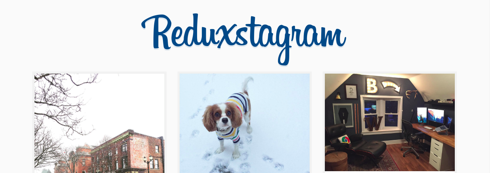

# Learn Redux by Wes Bos

All annotations and codes were based on the course created by [Wes Bos](http://wesbos.com). Below some useful information.

 - [__Website__](https://learnredux.com/)
 - [__Youtube__](https://www.youtube.com/watch?v=hmwBow1PUuo&list=PLu8EoSxDXHP5uyzEWxdlr9WQTJJIzr6jy)

## About

20 video tutorials to help you learn how to build JavaScript apps with React.js and Redux.

In 2.5 hours, You'll build 'Reduxstagram' — a simple photo app that will simplify the core ideas behind Redux, React Router and React.js

## Quick start

 1. Clone the repo: git clone `https://github.com/AlexsandroSA/studies`
 2. From the root __/learnredux__ directory, run `npm install` in the command line
 3. After install all depencedes run `npm start`
 4. Open http://localhost:7770 in your browser, and voilà :bowtie:
